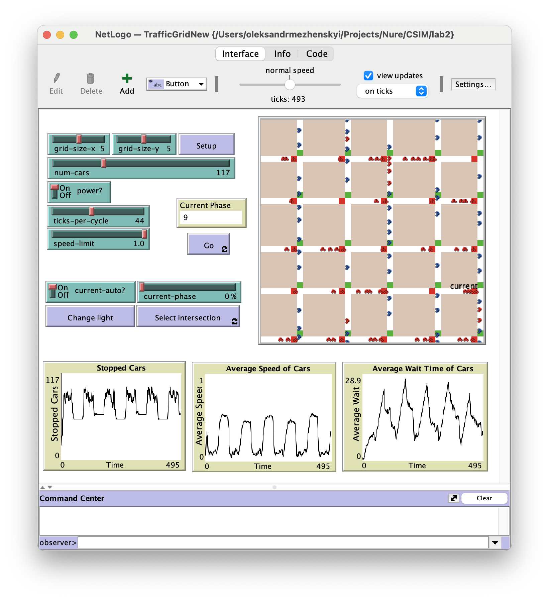
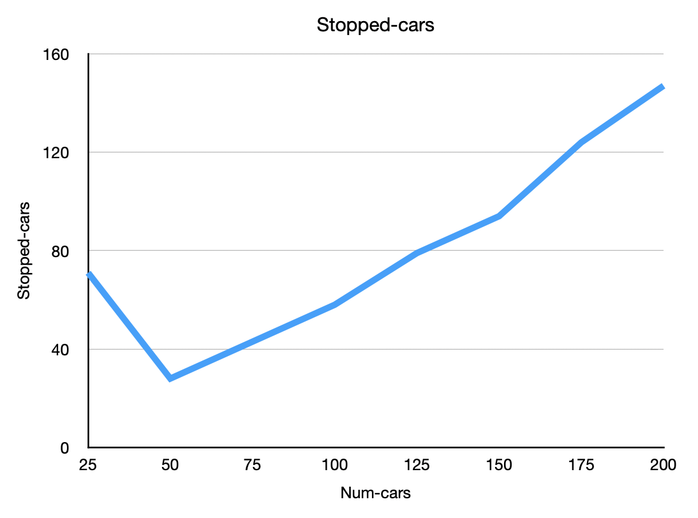
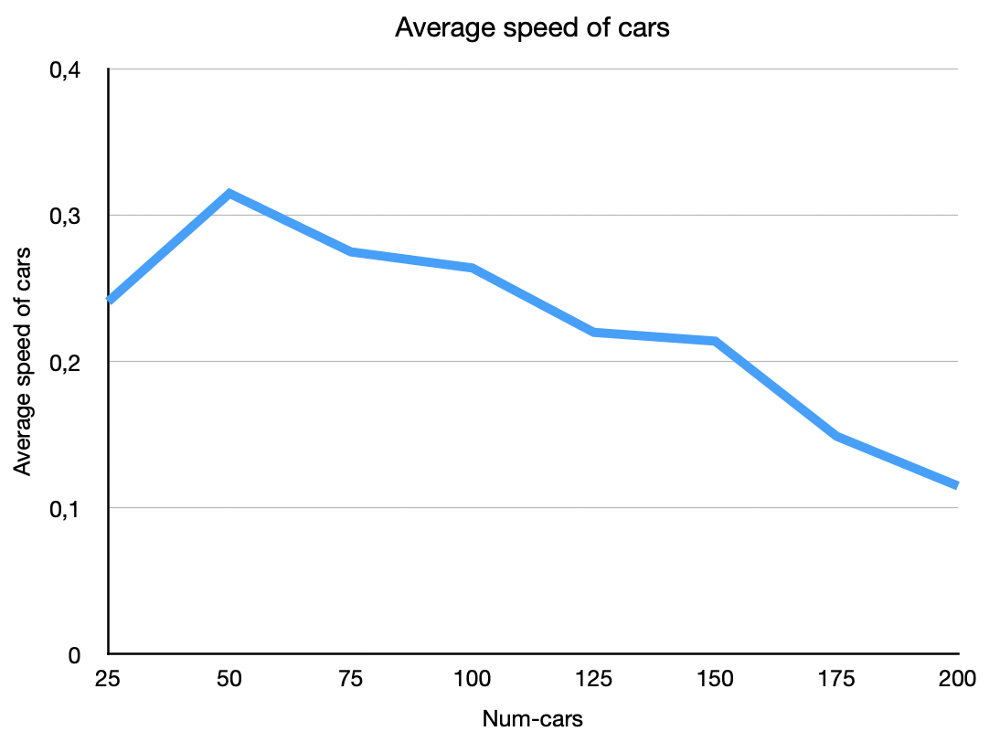
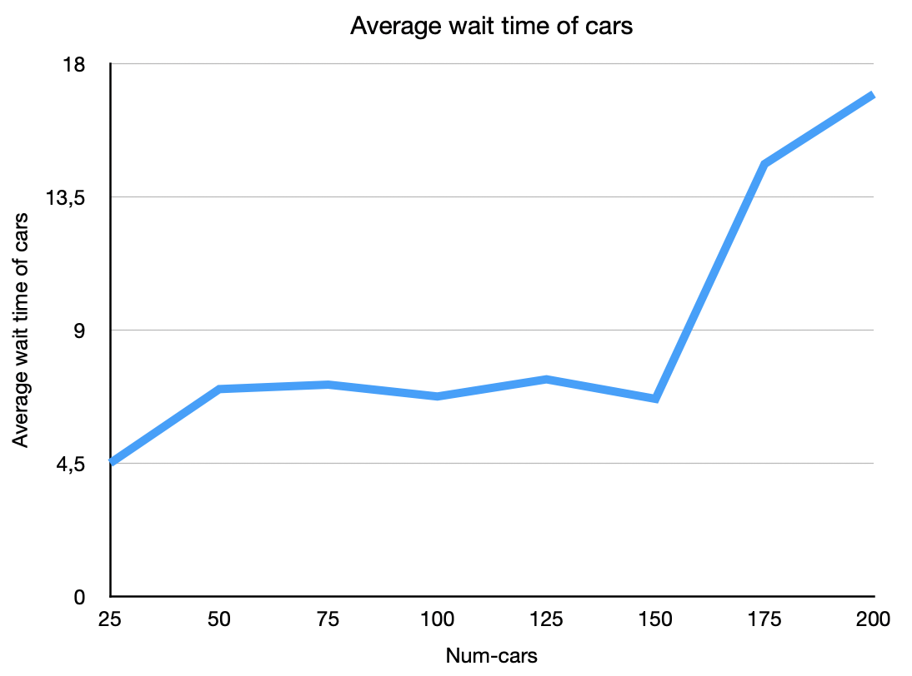

# Комп'ютерні системи імітаційного моделювання
## СПм-22-3, Меженський Олександр Олександрович
### Лабораторна робота №**2**. Редагування імітаційних моделей у середовищі NetLogo

 

### Варіант 1, модель у середовищі NetLogo:
[Traffic Grid](https://www.netlogoweb.org/launch#http://www.netlogoweb.org/assets/modelslib/Sample%20Models/Social%20Science/Traffic%20Grid.nlogo)

 

### Внесені зміни у вихідну логіку моделі, за варіантом:

**Додано жовтий сигнал світлофорів.**

Додано змінну для патча, яка відповідає за жовтий сигнал світлофора по аналогії з зеленим:
<pre>
  yellow-light? ;; true if the yellow light is on, false otherwise
</pre> 

Змінено процедуру setup-patches.

<pre>
to setup-patches
    ...
    ask patches
    [
      ...
      set yellow-light? false
      ...
    ]
    ...
end
</pre>

Змінено процедуру set-signal-colors. Вона змінює колір світлофора відповідно до умов.

<pre>
to set-signal-colors  ;; intersection (patch) procedure
  ifelse power?
  [
    ifelse yellow-light?
    [
      ask patch-at -1 0 [ set pcolor yellow ]
      ask patch-at 0 1 [ set pcolor yellow ]
    ]
    [
      ifelse green-light-up?
      [
        ask patch-at -1 0 [ set pcolor red ]
        ask patch-at 0 1 [ set pcolor green ]
      ]
      [
        ask patch-at -1 0 [ set pcolor green ]
        ask patch-at 0 1 [ set pcolor red ]
      ]
    ]
  ]
  [
    ask patch-at -1 0 [ set pcolor white ]
    ask patch-at 0 1 [ set pcolor white ]
  ]
end
</pre>

Змінено процедуру set-signals. Вона тепер може перемикати жовтий сигнал світлофора.

<pre>
to set-signals
  ask intersections with [auto? and phase = floor ((my-phase * ticks-per-cycle) / 100)]
  [
    ifelse yellow-light?
    [
      set yellow-light? false
      set green-light-up? (not green-light-up?)
    ]
    [
      set yellow-light? true
    ]
    set-signal-colors
  ]
end
</pre>

Змінено процедуру to set-car-speed. Водії не їдуть на жовтий сигнал світлофора.

<pre>
to set-car-speed  ;; turtle procedure
  ifelse pcolor = red or pcolor = yellow
  ...
end
</pre>

**Додати вірогідність початку руху водіями не тільки на зелений, але і на жовтий сигнал світлофора.**

Додано глобальну змінну, яка відповідає за вірогідність початку руху водіями не тільки на зелений, але і на жовтий сигнал світлофора. Вона ініціалізована значенням 25%.

<pre>
  probability-movement-yellow
</pre>

Модифіковано процедуру set-car-speed. Автомобілі з ймовірністю 25% їдуть на жовтий колір світлофора:

<pre>
to set-car-speed  ;; turtle procedure
  ifelse pcolor = red or (pcolor = yellow and probability-movement-yellow < random-float 100)
  [ set speed 0 ]
  [
    ifelse up-car?
    [ set-speed 0 -1 ]
    [ set-speed 1 0 ]
  ]
end
</pre>

### Внесені зміни у вихідну логіку моделі, на власний розсуд:

**Встановлення ліміту максимальної швидкості для кожної машини здійснюється індивідуально**

Додано змінну машин

<pre>
turtles-own
  [
  car-speed-limit
  ...
  ]
</pre>

Швидкість машин коливається навколо обмеження швидкості в місті

<pre>
   set car-speed-limit (speed-limit - 0.2) + (random-float ((speed-limit + 0.2) - (speed-limit - 0.2)))
   if car-speed-limit < 0.1 [set car-speed-limit 0.1]
</pre>

Модифіковано процедуру в яких використовувалась змінна speed-limit. Замість неї тепер особиста швидкість кожної машини. Також змінено колір машин, коли вони рухаються. До цього кольори машин теж змінювались, але це було важко помітити.

<pre>
to speed-up  ;; turtle procedure
  ifelse speed > car-speed-limit
  [ set speed car-speed-limit ]
  [ set speed speed + acceleration ]
end

;; set the color of the turtle to a different color based on how fast the turtle is moving
to set-car-color  ;; turtle procedure
  ifelse speed < (car-speed-limit / 2)
  [ set color blue ]
  [ set color red ]
end
</pre>

Фінальний код моделі та її інтерфейс доступні за
[посиланням](TrafficGridNew.nlogo)

 

## Обчислювальні експерименти
### 1. Вплив завантаженості дороги на кількість зупиненних автомобілів, середньої швидкісті автомобілів та середнього часу очікування автомобілів
Досліджується залежність кількості зупиненних автомобілів, середньої швидкісті автомобілів та середнього часу очікування автомобілів протягом певної кількості тактів (200) від числа машин на трасі, зазначеного на початку симуляції.
Експерименти проводяться при 25-200 автомобілях, з кроком 25, усього 8 симуляцій.  
Інші керуючі параметри мають значення за замовчуванням:
- **grid-size-x**: 5
- **grid-size-y**: 5
- **power**: On
- **ticks-per-cycle**: 20
- **speed-limit**: 1

<table>
<thead>
<tr><th>Кількість автомобілів</th><th>Кількість зупинених</th><th>Середня швидкість</th><th>Середній час очікування</th></tr>
</thead>
<tbody>
<tr><td>25</td><td>71</td><td>0,241</td><td>4,5</td></tr>
<tr><td>50</td><td>28</td><td>0,315</td><td>7,0</td></tr>
<tr><td>75</td><td>43</td><td>0,275</td><td>7,15</td></tr>
<tr><td>100</td><td>58</td><td>0,264</td><td>6,75</td></tr>
<tr><td>125</td><td>79</td><td>0,220</td><td>7,33</td></tr>
<tr><td>150</td><td>94</td><td>0,214</td><td>6,67</td></tr>
<tr><td>175</td><td>124</td><td>0,149</td><td>14,6</td></tr>
<tr><td>200</td><td>147</td><td>0,115</td><td>16,96</td></tr>
</tbody>
</table>

Графік наочно показує, що зростання кількості автомобілів може призвести до збільшення загального трафіку, що впливає на рух усіх учасників, утворенню заторів, зниження середньої швидкості та збільшення середнього часу очікування. Хоча ці показники були гіршими, коли був відсутній жовтий сигнал світлофора в першій версії моделі.
