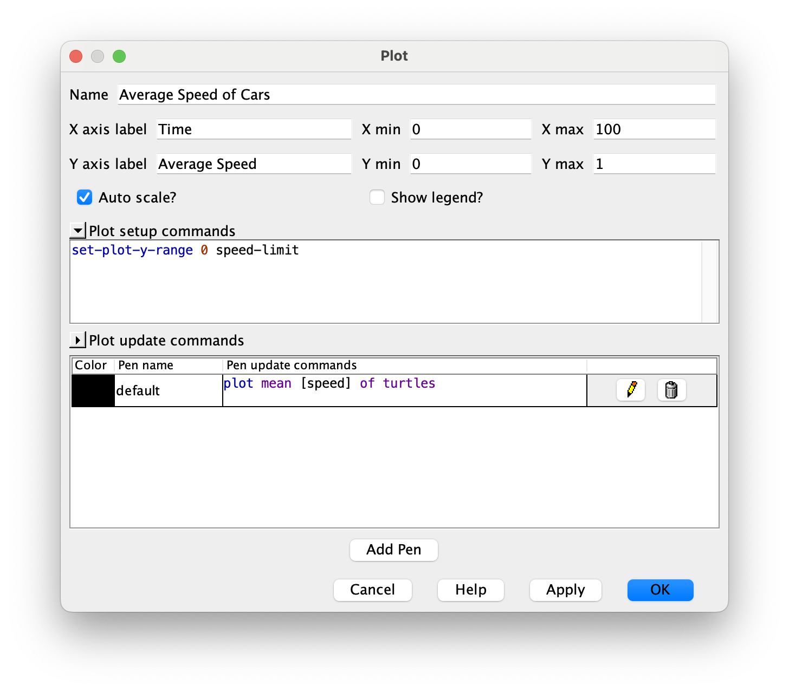
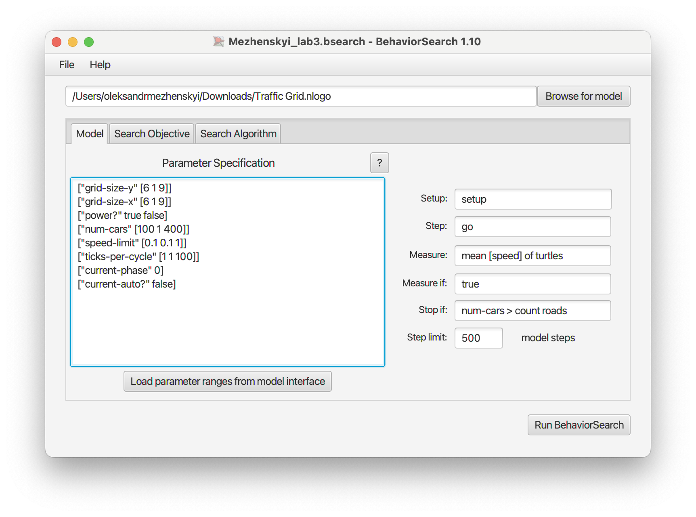
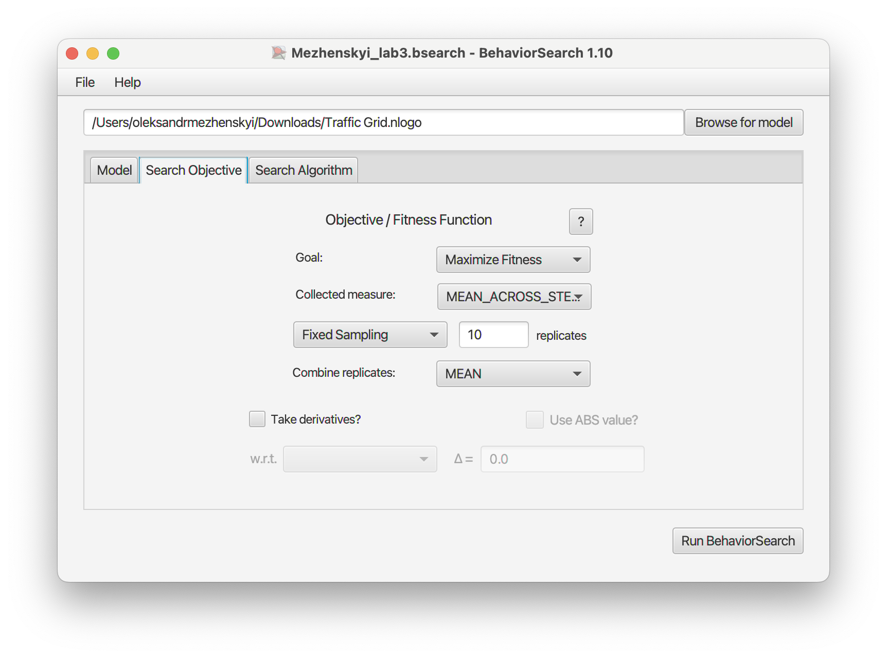
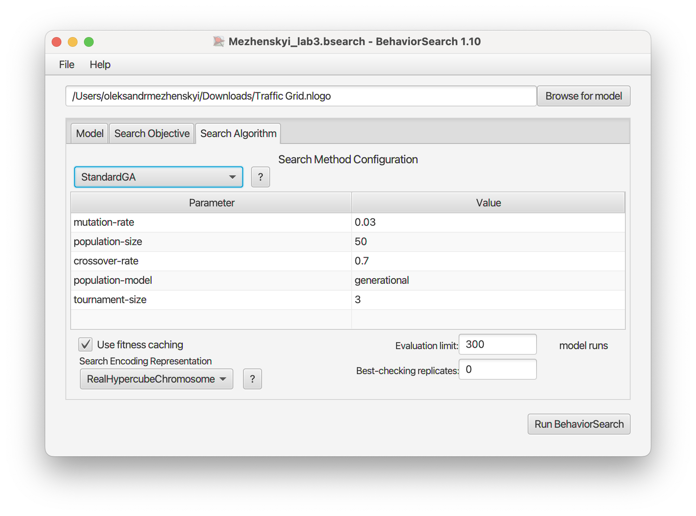
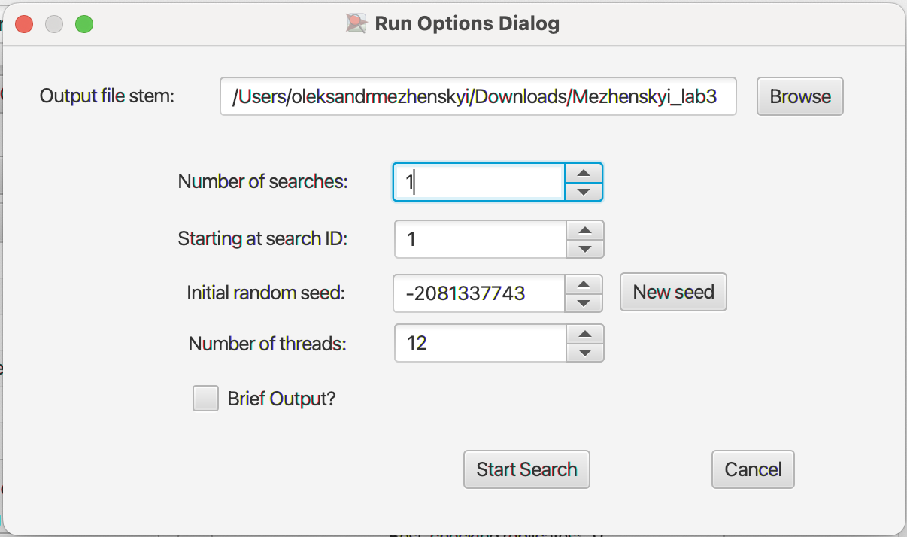
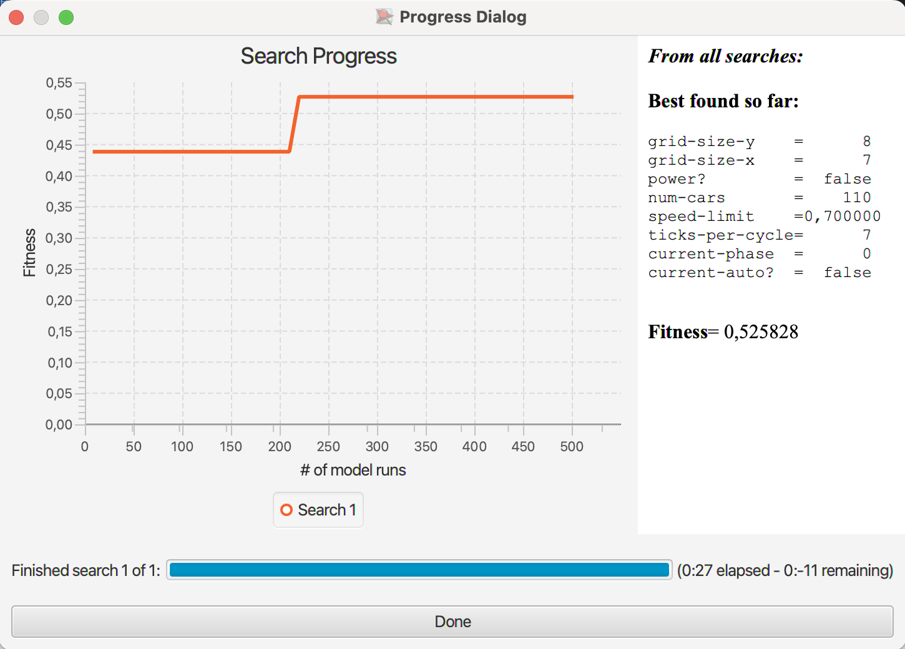
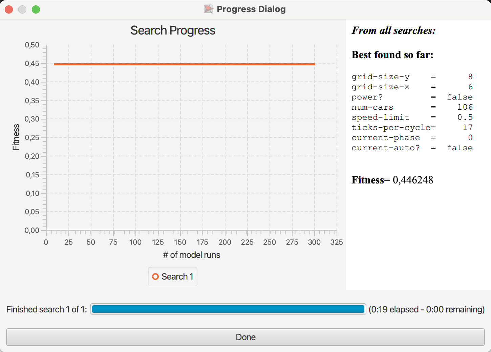

# Комп'ютерні системи імітаційного моделювання
## СПм-22-3, Меженський Олександр Олександрович
### Лабораторна робота №**3**. Використання засобів обчислювального інтелекту для оптимізації імітаційних моделей

 

### Варіант 1, модель у середовищі NetLogo:
[Traffic Grid](https://www.netlogoweb.org/launch#http://www.netlogoweb.org/assets/modelslib/Sample%20Models/Social%20Science/Traffic%20Grid.nlogo)

 

### Вербальний опис моделі:
Симуляція руху автомобілів по грід-системі доріг та перехресть. Кожен автомобіль у моделі представлений агентом, який слідує простим набором правил, регулюючи свою швидкість та рух. Розглядає взаємодію автомобілів на дорогах та перехрестях з метою вивчення впливу різних факторів на руховий потік та час очікування. Автомобілі взаємодіють між собою та реагують на світлофори на перехрестях.

### Налаштування середовища BehaviorSearch:

**Обрана модель**:
<pre>
/Users/oleksandrmezhenskyi/Downloads/Traffic Grid.nlogo
</pre>
**Параметри моделі** (вкладка Model):
<pre>
["grid-size-y" [6 1 9]]
["grid-size-x" [6 1 9]]
["power?" true false]
["num-cars" [100 1 400]]
["speed-limit" [0.1 0.1 1]]
["ticks-per-cycle" [1 1 100]]
["current-phase" 0]
["current-auto?" false]
</pre>
Використовувана **міра**:  :
Для фітнес-функції було обрано **середня швидкість автомобілів**. вираз для її розрахунку взято з налаштувань графіка аналізованої імітаційної моделі в середовищі NetLogo

та вказано у параметрі "**Measure**":
<pre>
mean [speed] of turtles
</pre>
Середня швидкість автомобілів враховується **в середньому** за весь період симуляції тривалістю, 500 тактів, починаючи з 0 такту симуляції.  
Параметр зупинки за умовою ("**Stop if**") виставлено в значення:
<pre>
  num-cars > count roads
</pre>
Загальний вигляд вкладки налаштувань параметрів моделі:

**Налаштування цільової функції** (вкладка Search Objective):  
Метою підбору параметрів імітаційної моделі є **максимізація** значення середньої швидкості автомобілів – це вказано через параметр "**Goal**" зі значенням **Maxsimize Fitness**. Тобто необхідно визначити такі параметри налаштувань моделі, у яких значення середньої швидкості автомобілів максимальна. При цьому цікавить не просто середня швидкість всіх машин у якийсь окремий момент симуляції, а середнє її значення за всю симуляцію. Для цього у параметрі "**Collected measure**", що визначає спосіб обліку значень обраного показника, вказано **MEAN_ACROSS_STEPS**.  
Щоб уникнути викривлення результатів через випадкові значення, що використовуються в логіці самої імітаційної моделі, **кожна симуляція повторюється по 10 разів**, результуюче значення розраховується як **середнє арифметичне**.
Загальний вигляд вкладки налаштувань цільової функції:

**Налаштування алгоритму пошуку** (вкладка Search Algorithm):  
Загальний вид вкладки налаштувань алгоритму пошуку:

 

### Результати використання BehaviorSearch:
Діалогове вікно запуску пошуку

Результат пошуку параметрів імітаційної моделі, використовуючи **генетичний алгоритм**:

Результат пошуку параметрів імітаційної моделі, використовуючи **випадковий пошук**:

 
